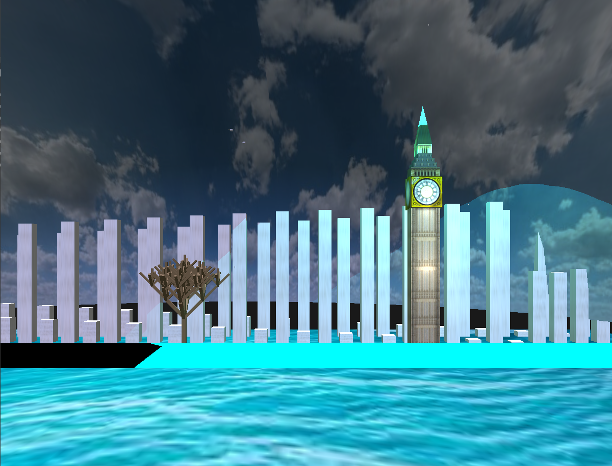

# 🏛️ Big Ben 3D Visualization  

### 🎨 An Interactive 3D Visualization of Big Ben using OpenGL & C++  

🚀 **Big Ben 3D Visualization** is a project that recreates Big Ben in 3D using **OpenGL 3.3**, this project incorporates **dynamic lighting, realistic textures, moving objects**, offering an immersive and interactive experience.  

---

## 📌 Features  

✔ **3D Model of Big Ben** – A detailed recreation of the clock tower with realistic textures.  
✔ **Fractal Trees & Environment** – A naturalistic touch to enhance the scene.  
✔ **Sky Dome** – Dynamic skybox reflecting different times of the day.  
✔ **Realistic Water Animation** – Flowing water with smooth wave movements.  
✔ **Flying Birds** – Animated birds soaring across the scene.  
✔ **Dynamic Lighting** – Specular, ambient, diffuse, and point lights with user-controlled toggles.  
✔ **Camera Controls** – Free-flow camera mode for a complete 360° experience.  

---

## 🎮 Keyboard Controls  

🔹 Camera Navigation  
- W / S – Move forward/backward  
- A / D – Move left/right  
- I / K – Pitch up/down  
- L / J – Yaw right/left  

🔹 Lighting Controls  
- N – Toggle night/day mode  
- M – Enable moonlight mode  
- 1 – Toggle point lights  
- 2 – Toggle specular lights  
- 3 – Toggle diffuse lights  
- 4 – Toggle ambient lights  
- 5 – Toggle spotlight  

🔹 Other Controls  
- Esc – Exit the application

---

## 🔧 Technologies Used  

- OpenGL 3.3 – Rendering & graphics pipeline  
- C++ – Core programming language  
- GLFW & GLAD – Window management & OpenGL functions  
- GLM – Matrix transformations  
- Shaders – Custom vertex & fragment shaders
  
---
## 🛠️ Setup & Installation

1️⃣ Clone the Repository  
git clone https://github.com/Shrabanti01/cg_project.git
cd cg_project 

2️⃣ Install Dependencies  
Ensure you have GLFW, GLAD, GLM, and OpenGL installed on your system.  

3️⃣ Build & Run  
Follow the compilation steps based on your system's requirements.  

---
## 🚀 Created By  
**Shrabanti Debnath** | 🎓 *Khulna University of Engineering & Technology*  
